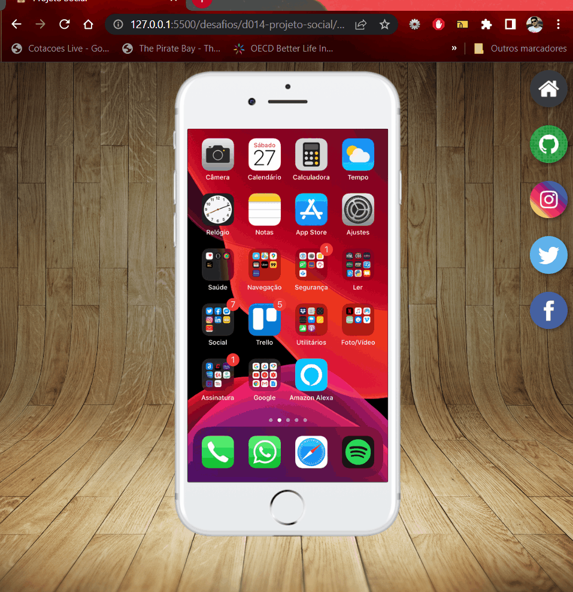

# Mini Projeto: Site das Redes Sociais

Nesse desafio, o desafio é fazer com que uma as minhas redes sociais carreguem na tela de uma imagem de um celular, clicando em ícones interativos

## Tecnologias utilizadas:

- HTML5;
- CSS3;

## Finalidade do Projeto:

Este projeto tem por finalidade praticar o conteúdo estudados durante o módulo 04 do Curso de HTML5 e CSS3 do Curso em Vídeo, ministrado pelo Prof. Gustavo Guanabara.
